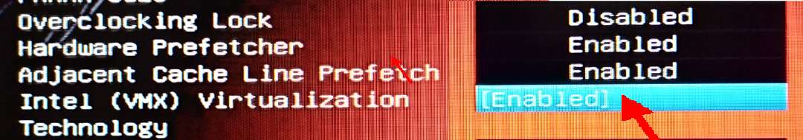
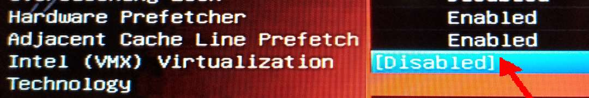
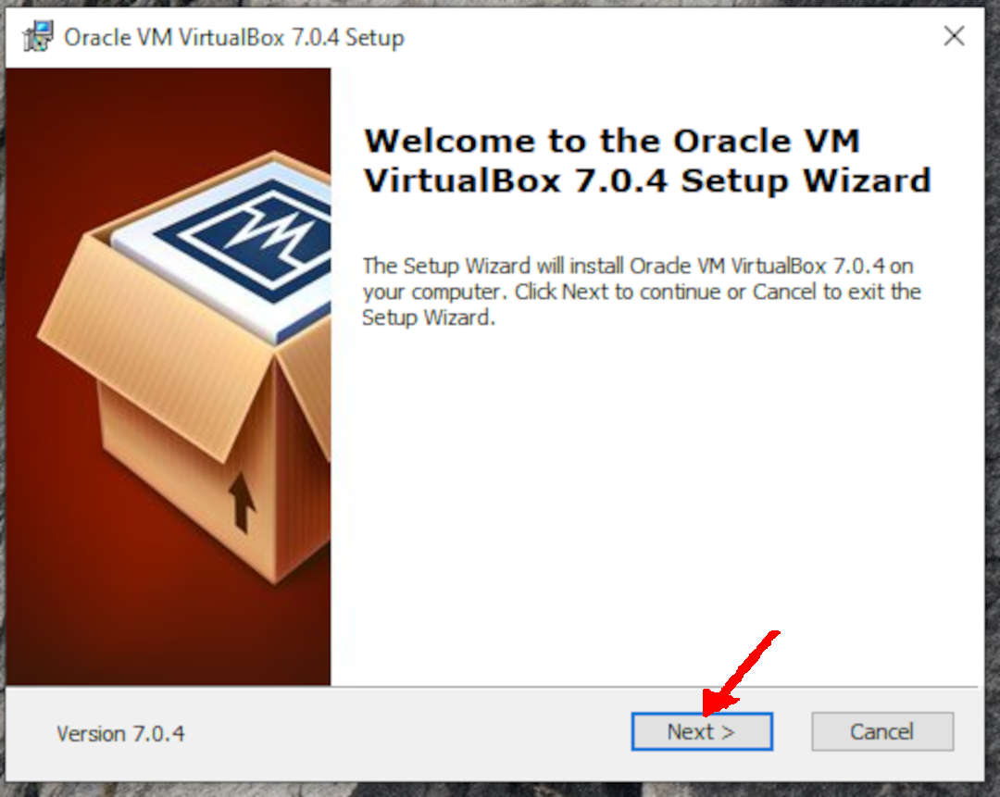
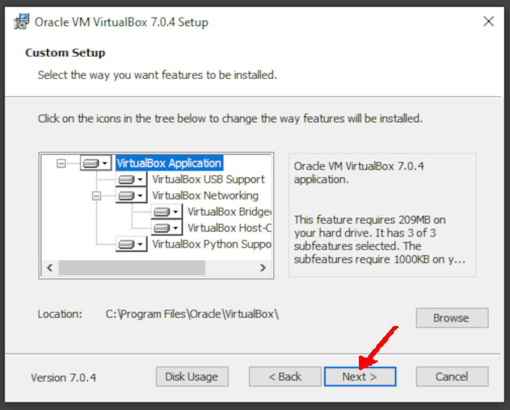
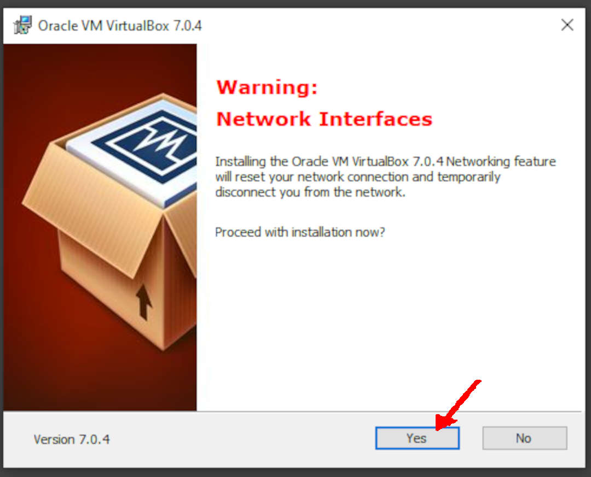
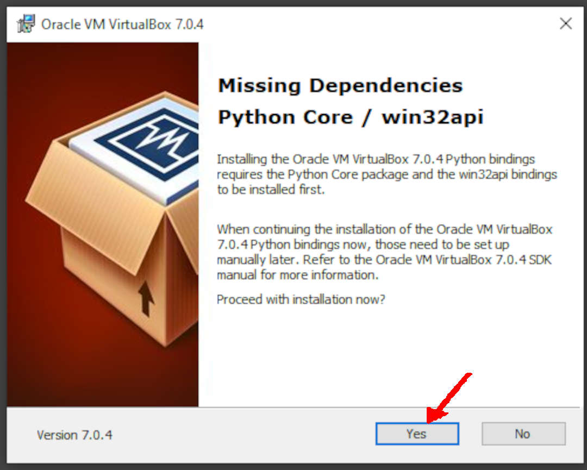
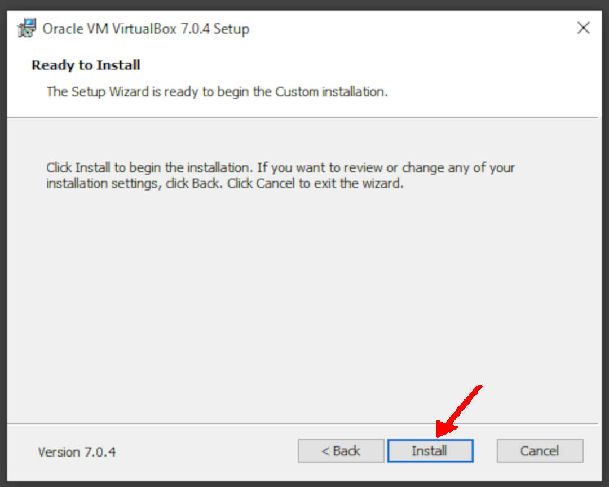
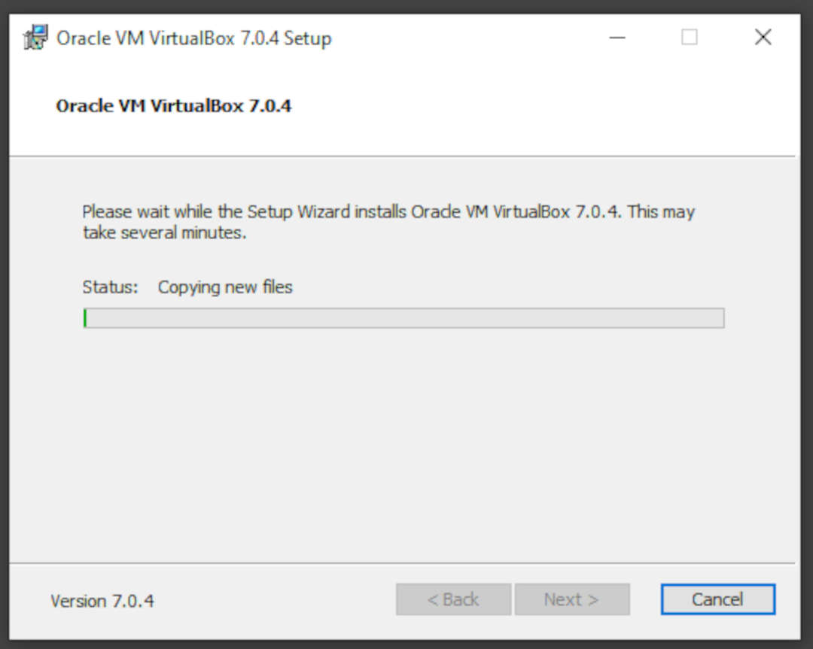
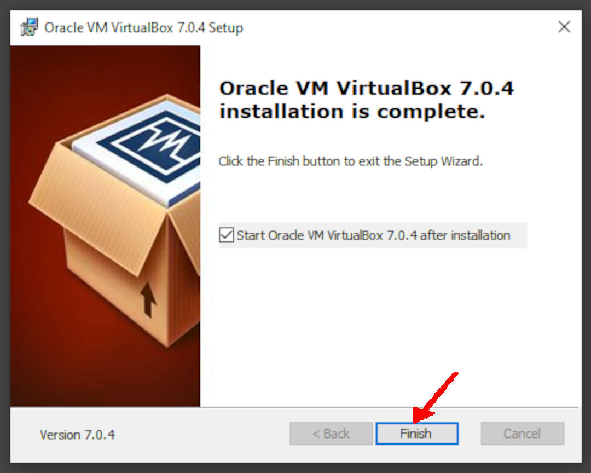

# Installing VirtualBox on Windows with Debian ISO
## Start your OS Virtualization Journey!


## Debian ISO Image
You can download the Debian ISO file from the official Debian website at the following URL: [`https://cdimage.debian.org/debian-cd/current/amd64/iso-cd/`](https://cdimage.debian.org/debian-cd/current/amd64/iso-cd/)


:::caution
The current ISO image is/was **`debian-12.0.0-amd64-netinst.iso`** — but this is subject to change.
:::

## Download Manager
Using a download manager when downloading large or multiple files simultaneously would be best, as it can help make the downloading process more efficient and reliable. Additionally, suppose you have a slower internet connection or experience frequent interruptions while downloading. In that case, a download manager can help improve your download speed and stability.

Download from 
[`https://www.freedownloadmanager.org/`](https://www.freedownloadmanager.org/), 
or install a plugin for your browser

## Intel (VMX) Virtualization Technology
You may need to <span class="important-text">ENABLE</span> VMX (Virtual Machine Extensions). Check your PC firmware configuration manual on how to do this. E.g.,

* VMX Enabled:


* VMX Disabled:



## Hyper-V
You may need to <span class="important-text">DISABLE</span>
Hyper-V on Microsoft Windows to install VirtualBox.
You can do this by running the following command in Admin PowerShell:
```bash
dism.exe /Online /Disable-Feature:Microsoft-Hyper-V
```

## Installing Virtualbox


* Download the latest version of VirtualBox for Windows from the Oracle website
 [`https://www.virtualbox.org/wiki/Downloads/`](https://www.virtualbox.org/wiki/Downloads/)

:::caution
  The VirtualBox version is/was `7.0.8` --- but this is subject to change.
  This example will use the previous version, `7.0.4`.
:::
  
* Once the download is complete, run the installer file by double-clicking.
* You will be prompted with a User Account Control (UAC) window. Click on "Yes" to continue.
* The VirtualBox Setup Wizard will appear. Click on "Next" to begin the installation process.
  
:::info
When doing the installation, most of the options are <span class="important-text">DEFAULT</span>. 
  Possible different answers will be marked with <span class="important-text">ARROWS</span>.
:::



* Read the license agreement, and if you agree, select "I Agree" and click "Next."
* Choose the defaults by clicking either "Yes" or "Next."





* Click "Install" to begin the installation process




* Once the installation is complete, you will be prompted to click "Finish."




```
Updated At: 12/07/2023
Path: docs/virtualbox/install-on-windows
```